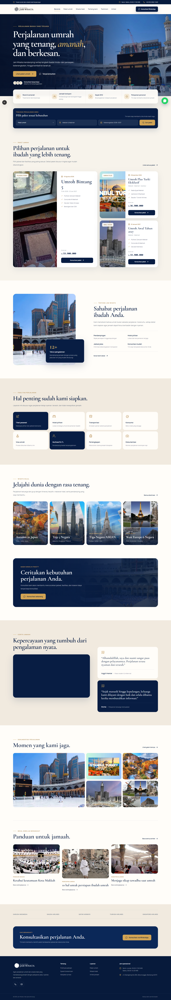

<div align="center">

# Jam Wisata

Website paket umrah dan wisata halal yang responsif, informatif, dan berorientasi pada konsultasi calon jamaah.

[Fitur](#fitur-utama) · [Menjalankan Proyek](#menjalankan-proyek) · [Pengujian](#pengujian) · [Struktur Proyek](#struktur-proyek)

</div>



## Tentang Proyek

Jam Wisata adalah website pemasaran perjalanan umrah dan wisata halal yang dibangun dengan Next.js. Halaman menyajikan informasi paket secara terstruktur, membantu pengunjung menyaring jadwal sesuai kebutuhan, dan mengarahkan pertanyaan ke WhatsApp dengan konteks paket yang dipilih.

Antarmuka dirancang mobile-first dengan navigasi adaptif, kartu paket, testimoni video yang dimuat secara lazy, dan WhatsApp concierge yang dapat dioperasikan menggunakan keyboard.

## Fitur Utama

- Hero dan pencarian paket berdasarkan bulan, jenis paket, maskapai, serta bandara keberangkatan.
- Filter paket yang tersinkron dengan query parameter URL.
- Informasi jadwal, hotel, fasilitas, maskapai, harga, dan status paket.
- Tautan WhatsApp dengan pesan konsultasi yang sudah disesuaikan konteks.
- Navigasi desktop dan mobile dengan dukungan keyboard.
- Testimoni YouTube dengan lazy loading melalui domain privasi `youtube-nocookie.com`.
- WhatsApp concierge dengan dialog aksesibel, focus trap, dan auto-open satu kali per sesi.
- Metadata SEO, Open Graph, dan canonical URL.
- Layout responsif yang diuji pada viewport 320 px hingga 1920 px.

## Teknologi

- [Next.js 16](https://nextjs.org/) dengan App Router dan output standalone
- [React 19](https://react.dev/) dan TypeScript strict
- [Tailwind CSS 4](https://tailwindcss.com/)
- [Lucide React](https://lucide.dev/) untuk ikon
- [lite-youtube-embed](https://github.com/paulirish/lite-youtube-embed) untuk video yang ringan
- [Playwright](https://playwright.dev/) untuk pengujian browser
- Docker multi-stage untuk image produksi

## Prasyarat

- Node.js 24 atau lebih baru
- npm

Docker bersifat opsional apabila aplikasi akan dijalankan dalam container.

## Menjalankan Proyek

1. Clone repository dan masuk ke direktori proyek.

   ```bash
   git clone https://github.com/hmad28/jamwisata.git
   cd jamwisata
   ```

2. Instal dependency.

   ```bash
   npm ci
   ```

3. Jalankan development server.

   ```bash
   npm run dev
   ```

4. Buka [http://localhost:3000](http://localhost:3000).

Proyek saat ini tidak memerlukan environment variable untuk penggunaan dasar. File `.env.local` atau `.env` tetap dapat digunakan oleh konfigurasi Docker jika diperlukan kemudian.

## Script

| Perintah | Kegunaan |
| --- | --- |
| `npm run dev` | Menjalankan development server |
| `npm run build` | Membuat production build |
| `npm run start` | Menjalankan production server hasil build |
| `npm run lint` | Memeriksa kode dengan ESLint |
| `npm run typecheck` | Memeriksa tipe TypeScript tanpa menghasilkan file |
| `npm run check` | Menjalankan lint, typecheck, dan build secara berurutan |

## Pengujian

Tes Playwright memverifikasi layout responsif, perilaku filter dan URL, navigasi mobile, lazy loading video, aksesibilitas WhatsApp concierge, stabilitas sticky header, dan error runtime browser.

Jalankan aplikasi terlebih dahulu:

```bash
npm run dev
```

Kemudian, dari terminal lain:

```bash
npx playwright test
```

## Menjalankan dengan Docker

Production container tersedia di port `3000` secara default:

```bash
docker compose up app --build
```

Development container tersedia di port `3001` secara default:

```bash
docker compose up dev --build
```

Port dapat diubah melalui environment variable `PORT` untuk production atau `DEV_PORT` untuk development.

## Struktur Proyek

```text
src/
  app/                 Halaman utama, layout, metadata, dan global styles
  components/sites/    Komponen antarmuka khusus Jam Wisata
  components/ui/       Primitive UI yang dapat digunakan ulang
  data/                Data paket dan helper WhatsApp
  types/               Tipe domain dan deklarasi TypeScript
public/sites/           Gambar dan aset lokal website
tests/                  Pengujian end-to-end Playwright
docs/research/          Audit, spesifikasi komponen, dan hasil inspeksi
docs/design-references/ Referensi visual desktop, tablet, dan mobile
scripts/                Script pengunduhan aset dan sinkronisasi tooling
```

## Memperbarui Konten

- Data paket umrah berada di `src/data/jamwisata.ts`.
- Struktur tipe paket berada di `src/types/jamwisata.ts`.
- Komponen halaman berada di `src/components/sites/jamwisata-com-2868cc8a/root-8a5edab2/`.
- Aset gambar berada di `public/sites/jamwisata-com-2868cc8a/root-8a5edab2/`.

Saat mengubah paket, pastikan nilai `departureMonth` menggunakan format `YYYY-MM` agar filter bulan tetap berfungsi.

## Lisensi

Kode proyek ini tersedia berdasarkan ketentuan pada [LICENSE](LICENSE). Hak atas merek, logo, foto, video, dan materi pihak ketiga tetap dimiliki oleh pemiliknya masing-masing.
